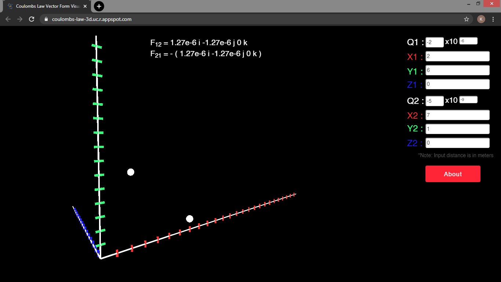

# Coulombs-Law-3D-Visualizer-in-P5-JS
Coulomb's Law 3D Visualizer built using P5-JS and Node JS.

## This visualizer is built using:

### 1) Frontend
  * P5 JS
  * Bootstrap
  
### 2) Backend
  * Express JS
  * Node JS

## Inputs Expected:
* Charge on the particle.
* X, Y, &  Z Coordinates (in meters).

## Examples



## Usage

1. Use the application online:

```
https://coulombs-law-3d.uc.r.appspot.com/
```

### or

1. Install this repository on your machine by downloading the zip file or running this command:

```
git clone https://github.com/KaranJagtiani/Coulombs-Law-3D-Visualizer-in-P5-JS.git
```

2. Run the Node server using this command:

```
node app.js
```

3. Use the application locally in your browser

```
http://localhost:3000/
```

## Enjoy!!
